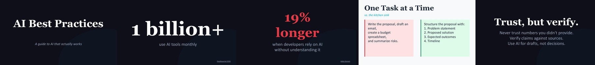

# AI Best Practices

[](LICENSE)
[](#the-decks)
[](https://claude.ai/claude-code)

Open-source presentation decks for learning and teaching AI — from your first prompt to orchestrating multi-agent workflows.



## Start here

**Learning AI on your own?** Start with the [reference deck PDF](decks/ai-best-practices/ai-best-practices.pdf) — self-paced, covers everything from prompt engineering to multi-agent orchestration.

**Running AI training for your team?** Grab the [pitch deck](decks/ai-academy-pitch/ai-academy-pitch.pdf) to sell the series, then run the two workshops in order. Each is a ~1 hour hands-on session.

**Setting AI policy for your company?** The [AI policy deck PDF](decks/ai-policy/ai-policy.pdf) covers GDPR, data residency, provider tiers, and a concrete recommended setup for EU and non-EU companies.

**Already shipping code with Claude Code?** The [Builder deck PDF](decks/builder/builder.pdf) is a practitioner's playbook for getting quality AND speed — how to set up your AI development infrastructure so agents produce production-grade output.

## The Decks

All decks follow a 7-level AI adoption spectrum. The reference deck and workshops are designed to be taken in order:

```
Skeptic → Explorer → Whisperer → Strategist → Operator → Orchestrator → Builder
```

### Reference & Expert Decks

| Deck | Slides | What it covers |
|------|--------|----------------|
| [Reference deck](decks/ai-best-practices/ai-best-practices.pptx) ([PDF](decks/ai-best-practices/ai-best-practices.pdf)) | 77 | The full journey — prompt engineering, context engineering, agents, orchestration |
| [Builder deck](decks/builder/builder.pptx) ([PDF](decks/builder/builder.pdf)) | 62 | The expert setup — quality AND speed with AI coding agents |
| [AI policy deck](decks/ai-policy/ai-policy.pptx) ([PDF](decks/ai-policy/ai-policy.pdf)) | 34 | AI tool selection for companies — GDPR, data residency, provider tiers, recommended setup |

### Workshop Series

Two hands-on sessions, ~1 hour each. All workshops use Claude (desktop app, Team or Enterprise plan).

| Workshop | Slides | You'll learn |
|----------|--------|--------------|
| [Explorer → Strategist](decks/workshop-1-strategist/workshop-1-strategist.pptx) ([PDF](decks/workshop-1-strategist/workshop-1-strategist.pdf)) | 31 | Prompt engineering, context engineering, personal preferences (rules) and Skills — from vague prompts to a persistent AI playbook |
| [Strategist → Orchestrator](decks/workshop-2-orchestrator/workshop-2-orchestrator.pptx) ([PDF](decks/workshop-2-orchestrator/workshop-2-orchestrator.pdf)) | 28 | Connectors, Cowork, trust and verification, and multi-agent Skill chains — from single tasks to orchestrating a team |

Need to sell the series first? The [AI Academy pitch deck](decks/ai-academy-pitch/ai-academy-pitch.pptx) ([PDF](decks/ai-academy-pitch/ai-academy-pitch.pdf)) is a 5-minute overview for leadership or attendees.

## Design philosophy

Every slide passes the 3-second billboard test. Maximum 15 words on screen, 28pt+ font, 50%+ whitespace. Detail lives in speaker notes. Inspired by Apple keynotes and TED talk guidelines.

## How this was built

Built by [@michaelengland](https://github.com/michaelengland) using [Claude Code](https://claude.ai/claude-code) and [deckwright](https://github.com/michaelengland/deckwright) for structured presentation development. Every deck — narratives, content outlines, slide designs, and generation code — is produced programmatically, not designed manually.

## Regenerating the decks

The `.js` files are the source of truth. Edit those, not the `.pptx` files.

```bash
npm install
node decks/ai-best-practices/ai-best-practices.js
node decks/ai-academy-pitch/ai-academy-pitch.js
node decks/workshop-1-strategist/workshop-1-strategist.js
node decks/workshop-2-orchestrator/workshop-2-orchestrator.js
node decks/builder/builder.js
node decks/ai-policy/ai-policy.js
```

Requires Node.js 18+. All decks generated with [PptxGenJS](https://github.com/nickvdyck/PptxGenJS).

## License

MIT — use freely. Attribution appreciated but not required.
